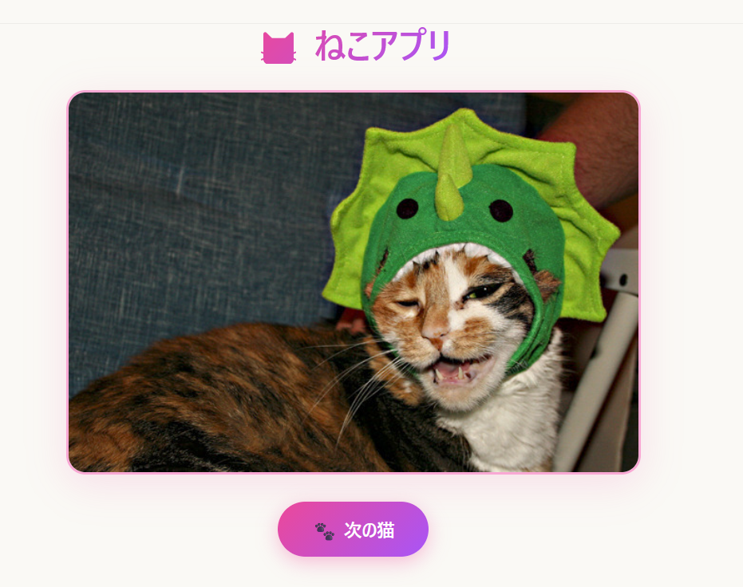

# Neko MCP Apps

かわいい猫をランダムに表示するMCP Appsです。



## ファイル構成

```
neko-mcp-app/
├── server.ts          # MCP サーバー（ツール + リソース登録）
├── main.ts            # HTTP/stdio エントリーポイント
├── mcp-app.html       # UI の HTML テンプレート
├── src/
│   ├── mcp-app.ts     # クライアント側アプリロジック
│   ├── mcp-app.css    # かわいいスタイル（ピンク/パープルのグラデーション）
│   ├── global.css     # ベーススタイル（ホストテーマ変数対応）
│   └── vite-env.d.ts
├── vite.config.ts
├── tsconfig.json / tsconfig.server.json
└── package.json
```

## 機能

- get-random-cat ツール（モデルから呼び出し可）

  — The Cat APIからランダムな猫を取得し、画像・品種名・説明・気質タグを表示

- next-cat ツール（アプリ専用）— UI の「次の猫」ボタンから呼ばれる
- ダーク/ライトモード対応、ホストのテーマ変数に追従
- 画像読み込みアニメーション、フェードイン効果

## 起動方法

### 開発（ウォッチモード）

```bash
npm run dev
```

### または本番ビルド後に起動

```bash
npm run build && npm run serve
```

サーバーは http://localhost:3001/mcp で起動します。

